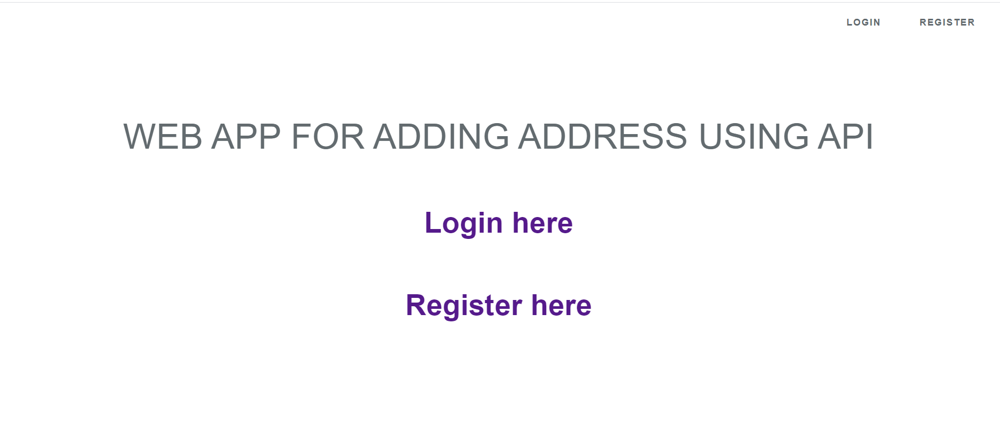
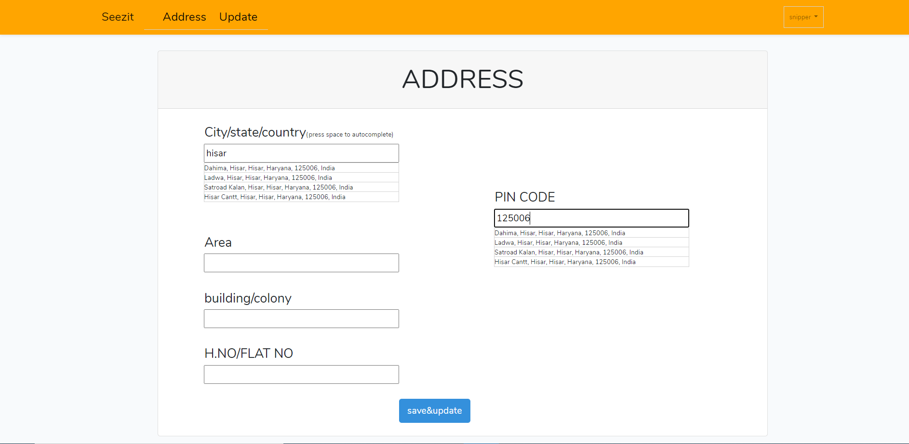
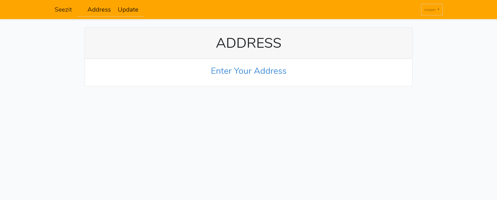
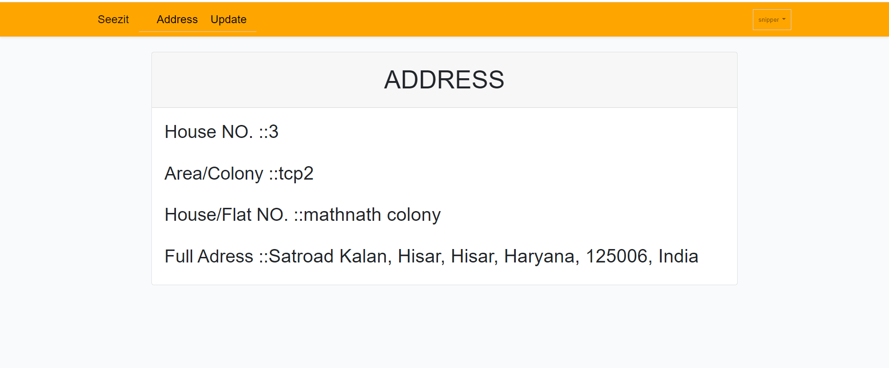

## About Laravel

Laravel is a web application framework with expressive, elegant syntax. We believe development must be an enjoyable and creative experience to be truly fulfilling. Laravel takes the pain out of development by easing common tasks used in many web projects, such as:

- [Simple, fast routing engine](https://laravel.com/docs/routing).
- [Powerful dependency injection container](https://laravel.com/docs/container).
- Multiple back-ends for [session](https://laravel.com/docs/session) and [cache](https://laravel.com/docs/cache) storage.
- Expressive, intuitive [database ORM](https://laravel.com/docs/eloquent).
- Database agnostic [schema migrations](https://laravel.com/docs/migrations).
- [Robust background job processing](https://laravel.com/docs/queues).
- [Real-time event broadcasting](https://laravel.com/docs/broadcasting).

##  TOOL/Language/framework
     1.LOcationiQ:- https://locationiq.com/pricing    ( API )
     2.laravel
     3. vue.js
     
 ## Register

## Find YOUR ADDRESS
   This locationiQ API help you find your city , state and country using name or postalcode
   
## ADD YOUR ADDRESS
Add your full adress

 
 ## Show ADD ADDRESS
 
 
 
 
